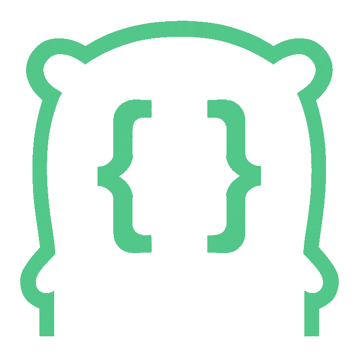

# GoTyper

<p align="center">
    
</p>

A command-line tool that converts JSON to Go structs with appropriate JSON tags.

## Features

- Converts JSON from files or stdin to Go structs
- Interactive mode for quick, ad-hoc conversions
- Detects appropriate Go types including special types like UUIDs and timestamps
- Handles nested objects and arrays
- Generates proper JSON tags with omitempty where appropriate
- Formats output according to Go standards
- Provides clear error messages for invalid inputs

## Installation

```bash
go install github.com/mcncl/gotyper@latest
```

## Usage

### Basic Usage

```bash
# From a file
gotyper -i input.json -o output.go

# From stdin
cat input.json | gotyper > output.go

# Interactive mode (just run gotyper with no arguments)
gotyper
# Then paste your JSON and press Ctrl+D (or Ctrl+Z on Windows) when done
```

### Command Line Options

```
  -i, --input=STRING     Path to input JSON file. If not specified, reads from stdin.
  -o, --output=STRING    Path to output Go file. If not specified, writes to stdout.
  -p, --package=STRING   Package name for generated code. (default: main)
  -r, --root-name=STRING Name for the root struct. (default: RootType)
  -f, --format           Format the output code according to Go standards. (default: true)
  -d, --debug            Enable debug logging.
  -v, --version          Show version information.
  -I, --interactive      Run in interactive mode, allowing direct JSON input with Ctrl+D to process.
```

### Interactive Mode

The interactive mode allows you to quickly convert JSON to Go structs without creating temporary files:

1. Run `gotyper` with no arguments (or with the `-I` flag)
2. Paste your JSON data at the prompt
3. Press Ctrl+D (Unix/Mac) or Ctrl+Z followed by Enter (Windows) to signal the end of input
4. The generated Go structs will be displayed immediately

## Examples

### Input JSON

```json
{
  "name": "John Doe",
  "age": 30,
  "email": "john@example.com",
  "is_active": true,
  "created_at": "2023-01-01T12:00:00Z",
  "address": {
    "street": "123 Main St",
    "city": "Anytown",
    "zip": "12345"
  },
  "tags": ["developer", "golang"],
  "scores": [98, 87, 95]
}
```

### Output Go Code

```go
package main

import (
	"time"
)

type Address struct {
	City   string `json:"city"`
	Street string `json:"street"`
	Zip    string `json:"zip"`
}

type RootType struct {
	Address   *Address  `json:"address,omitempty"`
	Age       int64     `json:"age"`
	CreatedAt time.Time `json:"created_at"`
	Email     string    `json:"email"`
	IsActive  bool      `json:"is_active"`
	Name      string    `json:"name"`
	Scores    []int64   `json:"scores,omitempty"`
	Tags      []string  `json:"tags,omitempty"`
}
```

## Type Detection

GoTyper automatically detects appropriate Go types:

- Strings → `string`
- Numbers → `int64` or `float64`
- Booleans → `bool`
- Null → pointer types with `omitempty` tag
- Objects → custom struct types
- Arrays → slices of appropriate types
- ISO8601 timestamps → `time.Time`
- UUIDs → `uuid.UUID`

## Error Handling

GoTyper provides clear error messages for common issues:

- Empty input
- Invalid JSON syntax
- File not found
- Multiple JSON values at root

## License

MIT
